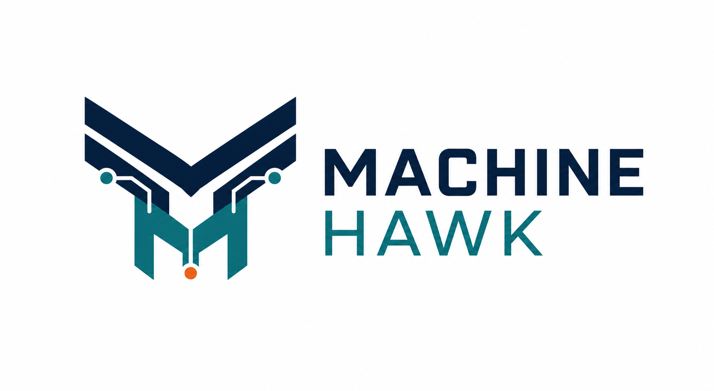
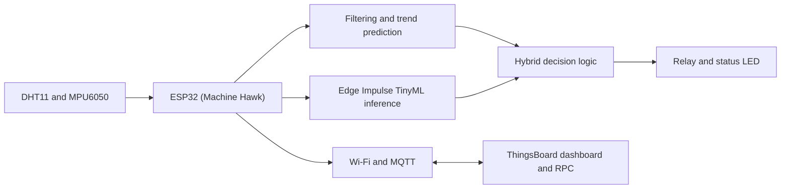

# Machine Hawk Predictive Maintenance System

<p align="center">
  
</p>

[](https://choosealicense.com/licenses/mit/)


## Overview

### What is it?

Machine Hawk is an edge-based predictive maintenance system running on a single ESP32. It samples temperature, humidity, and vibration data; forecasts temperature trends using a moving average; utilizes a Tensor Flow Lite Micro / Edge Impulse TinyML model to detect and score anomalies; and publishes telemetry to a ThingsBoard dashboard via MQTT. When an anomaly is detected, the ESP32 automatically triggers a local relay and an alert status LED.

### Why did we build it?

The project explores how condition-monitoring can run directly on low-cost embedded hardware at the edge, without relying on external gateways or continuous cloud-side inference. It combines sensor processing, trend forecasting, TinyML, MQTT connectivity, and remote actuator override controls in one practical IoT system.

## Features

- **Multi-Sensor Acquisition**: Reads temperature/humidity (DHT11) and motion/acceleration (MPU6050).
- **Trend Forecasting**: Smooths temperature readings with a moving average and estimates short-term trends.
- **On-Device Inference**: Runs Edge Impulse TinyML inference on-device for anomaly scoring.
- **Hybrid Decision Logic**: Combines TinyML anomaly scoring with rules-based temperature and trend threshold limits.
- **Safety Tripping**: Triggers a 5 V safety isolation relay and alert LED when an anomaly is detected.
- **Telemetry Sync**: Publishes diagnostics (temperatures, predicted temperature, anomaly score, status) to ThingsBoard.
- **Remote Actuation Override**: Supports cloud-to-device RPC messages to control the relay remotely.

## Architecture



[](docs/architecture-diagram.png)

## Tech Stack

| Area | Technology |
| --- | --- |
| Microcontroller | ESP32 DevKit |
| Sensors | DHT11 and MPU6050 |
| Edge ML | Edge Impulse SDK / TensorFlow Lite Micro |
| Firmware | C++ (Modular OOP) with Arduino framework |
| Connectivity | Wi-Fi and MQTT (`PubSubClient`) |
| Cloud dashboard | ThingsBoard |
| Tooling | PlatformIO |
| Actuation | 5 V relay and status LED |

## Project Structure

The project layout follows a structured, clean monorepo organization:

```text
Machine-Hawk/
├── README.md
├── LICENSE
├── docs/
│   ├── architecture.png
│   ├── workflow.png
│   ├── presentation.pdf
│   └── demo-images/                 # Circuit connections & diagrams
├── firmware/
│   └── esp32/
│       ├── src/                     # Modular OOP C++ sources (main.cpp, Config.h, managers)
│       ├── include/                 # Custom headers
│       ├── edge_impulse/            # Local rebranded Edge Impulse TinyML inference library
│       └── platformio.ini           # ESP32 platform build configuration
├── backend/
│   ├── app.py                       # Python app server
│   ├── mqtt_handler.py              # MQTT message transceiver
│   ├── health_engine.py             # Predictive diagnostics calculations
│   ├── recommendation_engine.py     # Maintenance recommendation generator
│   └── requirements.txt             # Python dependencies
├── web/
│   ├── src/                         # Frontend sources
│   ├── public/                      # Static assets
│   ├── package.json                 # Frontend dependencies configuration
│   └── README.md                    # Frontend documentation
├── ai/
│   ├── edge_impulse_model/          # TinyML model design configurations
│   ├── linear_regression/           # Reference regression models
│   └── notebooks/                   # Jupyter notebooks for model validation
├── data/
│   ├── sample_data.csv              # Small sample dataset for local tests
│   └── demo_dataset.csv             # Full verification dataset
└── assets/
    ├── logo.png                     # Machine Hawk logo
    ├── screenshots/                 # Application screenshots & UI demos
    └── demo_video.mp4               # Full functional demonstration video
```

## How to Build

### Hardware Setup

| Component | ESP32 pin | Notes |
| --- | --- | --- |
| DHT11 data | GPIO 4 | Temperature and humidity |
| MPU6050 SDA | GPIO 21 | I2C data |
| MPU6050 SCL | GPIO 22 | I2C clock |
| Relay module | GPIO 5 | Active-low appliance control |
| Status LED | GPIO 2 | Visual alert |

[](docs/demo-images/circuit-connections.jpg)

[](docs/demo-images/circuit-diagram.png)

### Firmware Compilation

1. Clone the repository and navigate to the `firmware/esp32/` directory.
2. The PlatformIO config (`platformio.ini`) is pre-configured with `lib_extra_dirs = edge_impulse`, meaning PlatformIO will automatically discover the rebranded local TinyML library `machine-hawk-inferencing` without any manual copy steps.
3. Open `firmware/esp32/src/Config.h` and update your Wi-Fi SSID, password, and ThingsBoard credentials:
   - `WIFI_SSID`
   - `WIFI_PASSWORD`
   - `MQTT_TOKEN`
4. Build the firmware using PlatformIO:

   ```bash
   cd firmware/esp32
   pio run
   ```

## How to Run

1. Connect the ESP32 to your development machine over USB.
2. Upload the compiled firmware:

   ```bash
   cd firmware/esp32
   pio run --target upload
   ```

3. View console telemetry at 115200 baud:

   ```bash
   pio device monitor --baud 115200
   ```

4. Import `dashboard/dashboard-export.json` into ThingsBoard to display real-time diagnostics.

## Example Telemetry

After booting, the Machine Hawk system starts publishing MQTT telemetry approximately every 2.5 seconds:

```json
{
  "temperature": 30.1,
  "predicted_temp": 31.0,
  "anomaly_score": 12.45,
  "anomaly": false
}
```

If the TinyML classification score exceeds the threshold, or the current/predicted temperature exceeds limits, the local relay and alarm LED trip immediately. Remote overrides are also possible via ThingsBoard RPC commands (`true` / `false` payloads).

[](assets/screenshots/ThingsBoard%20dashboard.png)

[](assets/screenshots/anomaly-detection.jpg)

## Future Improvements

- **Gas/Smoke Hazard Detection**: Integrate an MQ-2 gas/smoke sensor for hybrid safety alerts (monitoring electrical faults, arcing, and wiring overheating alongside the TinyML mechanical vibration analysis).
- Add OTA firmware updates and connection-recovery telemetry.
- Add deep-sleep and power-consumption optimization for remote battery deployments.
- Calibrate thresholds and retrain the model with machine-specific data.
- Add industrial integrations such as Modbus and richer alerting workflows.
- Explore longer-horizon forecasting models, such as an LSTM, where resources allow.

## Learning Outcomes

- Designing an end-to-end edge-to-cloud IoT architecture.
- Collecting and processing multi-sensor data on a microcontroller.
- Training, exporting, and deploying a TinyML model to an ESP32.
- Combining model predictions with conventional rule-based control.
- Publishing MQTT telemetry and building a cloud monitoring workflow.
- Working within embedded memory, timing, and reliability constraints.

## License

This project is licensed under the [MIT License](LICENSE).


  To make pio run --target upload work out-of-the-box on Ubuntu, configure your user permissions first:

  1. Add your user to the dialout group (grants serial port access):
    sudo usermod -a -G dialout $USER
    (Note: You will need to log out of Ubuntu and log back in for this to take effect).
  2. Install PlatformIO's udev rules (helps identify and set permissions for all USB microcontrollers):
    curl -fsSL https://raw.githubusercontent.com/platformio/platformio-core/master/platformio/assets/system/99-platformio-udev.rules | sudo
  tee /etc/udev/rules.d/99-platformio-udev.rules
    sudo udevadm control --reload-rules
    sudo udevadm trigger
