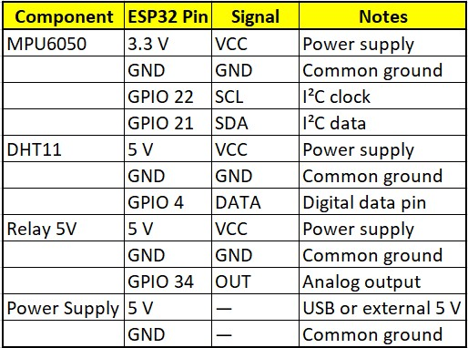

# Edge AI Predictive Maintenance System | ESP32 + TinyML

[](https://choosealicense.com/licenses/mit/)


A **complete standalone Edge AI IoT system** built on a **single ESP32** that performs real-time environmental monitoring, trend prediction, and intelligent anomaly detection using TinyML — eliminating the need for a gateway like Raspberry Pi.

---

## 🎯 Project Highlights

- **End-to-End Edge AI Implementation** on resource-constrained hardware
- On-device **TinyML Anomaly Detection** using Edge Impulse
- Hybrid intelligence combining **rule-based + predictive + ML-based** decisions
- Bidirectional IoT system with real-time cloud dashboard
- Production-ready features: secure MQTT, OTA-ready architecture, robust error handling

## ✨ Key Features

- Real-time monitoring of Temperature, Humidity & Vibration
- Moving Average filtering + Linear Regression for trend forecasting
- **TinyML-powered Anomaly Detection** (vibration & environmental deviations)
- Intelligent predictive actuation using 5V Relay
- Secure MQTT telemetry to ThingsBoard
- Responsive web dashboard with real-time graphs, predicted trends & remote control
- Low-power design with stable performance

## 🛠️ Tech Stack

| Layer              | Technology                          |
|--------------------|-------------------------------------|
| **Microcontroller**| ESP32 DevKit                        |
| **Sensors**        | DHT11, MPU6050 (6-axis)             |
| **Edge AI**        | Edge Impulse (TinyML)               |
| **Firmware**       | C++ (Arduino Core)                  |
| **Communication**  | Wi-Fi + MQTT (PubSubClient)         |
| **Cloud**          | ThingsBoard (Real-time Dashboard)   |
| **Actuation**      | 5V Relay + Status LED               |

## 📊 System Architecture

```mermaid
graph TD
    A[Sensors: DHT11 + MPU6050] --> B[ESP32 Edge AI Node]
    B --> C[Data Acquisition & Moving Average]
    B --> D[Linear Regression Prediction]
    B --> E[TinyML Anomaly Detection]
    C & D & E --> F[Hybrid Decision Engine]
    F --> G[Relay + LED Actuation]
    B --> H[MQTT Telemetry]
    H --> I[ThingsBoard Cloud Dashboard]
    I --> G
🚀 Quick Start

Clone the repository
Update Wi-Fi credentials and ThingsBoard Access Token
Install libraries:
DHT sensor library
Adafruit MPU6050
PubSubClient

Upload firmware/src/main.cpp to ESP32
Open ThingsBoard dashboard

📸 Project Screenshots & Demo

Watch Full Demo Video
Dashboard: Real-time gauges, time-series with predicted trends, anomaly alerts
Hardware Setup: Clean breadboard + sensor integration

🔧 Hardware Connections- 

Component,ESP32 Pin,Notes
DHT11,GPIO 4,Temperature & Humidity
MPU6050 SDA,GPIO 21,I2C
MPU6050 SCL,GPIO 22,I2C
Relay Module,GPIO 5,Appliance control
Status LED,GPIO 2,Visual feedback
📚 What I Learned

End-to-End Edge Computing architecture
Training, optimizing, and deploying TinyML models on microcontrollers
Sensor fusion and real-time embedded systems programming
Hybrid AI + traditional logic systems
IoT protocol implementation and cloud integration
Debugging memory & performance constraints on ESP32

🔮 Future Scope

Deep Sleep power optimization
Over-The-Air (OTA) firmware updates
Advanced LSTM-based forecasting
Integration with industrial protocols (Modbus)


Made with ❤️ using Edge Impulse & ESP32