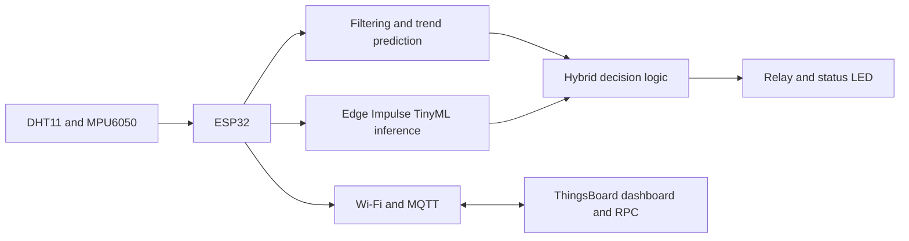
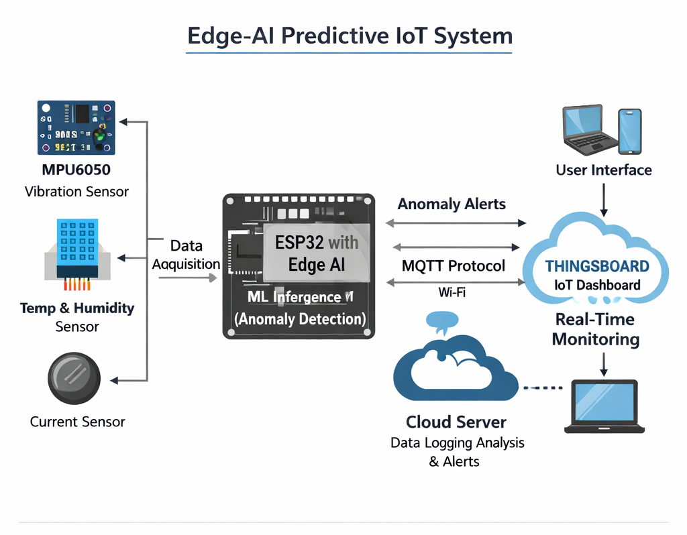
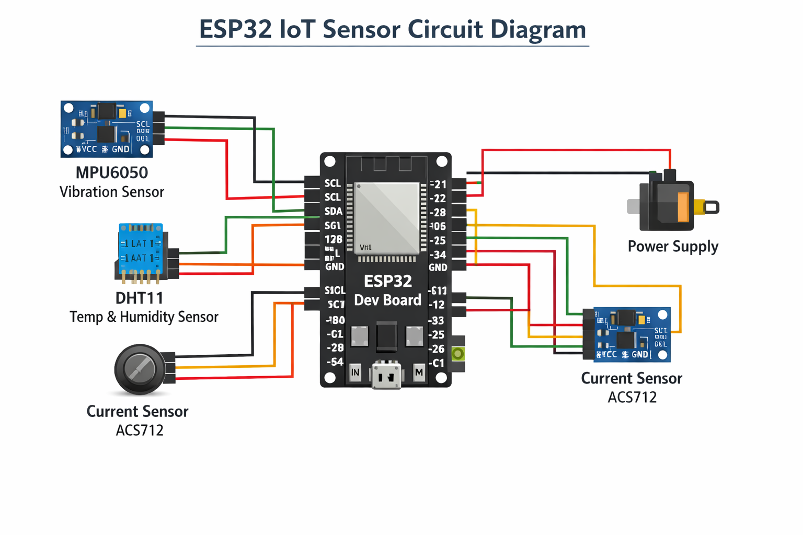
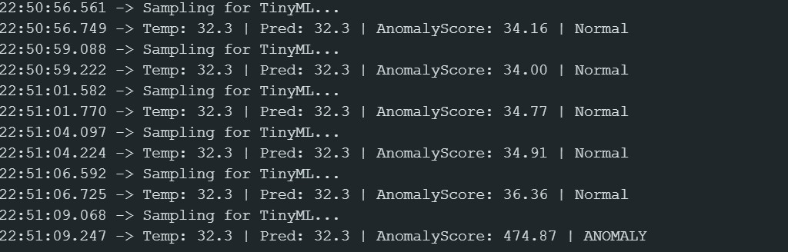

# Edge AI Predictive Maintenance System

[](https://choosealicense.com/licenses/mit/)


## Overview

### What is it?

An edge-based predictive-maintenance system that runs on a single ESP32. It samples temperature, humidity, and vibration data; forecasts temperature trends; uses an Edge Impulse TinyML model to score anomalies; and publishes telemetry to a ThingsBoard dashboard. When an anomaly is detected, the ESP32 activates a relay and status LED.

### Why did you build it?

The project explores how condition monitoring can run directly on low-cost embedded hardware, without a gateway or continuous cloud-side inference. It combines sensor processing, simple forecasting, TinyML, MQTT, and remote monitoring in one practical IoT system.

## Features

- Reads temperature and humidity from a DHT11 and motion data from an MPU6050.
- Smooths temperature readings with a moving average and estimates a near-term trend.
- Runs on-device Edge Impulse inference for anomaly scoring.
- Combines ML results with temperature and predicted-temperature thresholds.
- Controls a 5 V relay and status LED when an anomaly is detected.
- Sends temperature, predicted temperature, anomaly score, and anomaly state to ThingsBoard through MQTT.
- Accepts ThingsBoard RPC messages for remote relay control.

## Architecture



[](docs/architecture-diagram.png)

## Tech Stack

| Area | Technology |
| --- | --- |
| Microcontroller | ESP32 DevKit |
| Sensors | DHT11 and MPU6050 |
| Edge ML | Edge Impulse SDK / TensorFlow Lite Micro |
| Firmware | C++ with Arduino framework |
| Connectivity | Wi-Fi and MQTT (`PubSubClient`) |
| Cloud dashboard | ThingsBoard |
| Tooling | PlatformIO |
| Actuation | 5 V relay and status LED |

## Project Structure

```text
.
├── firmware/
│   ├── src/main.cpp                 # PlatformIO firmware entry point
│   ├── EdgeAI_Predictive_System.ino # Arduino IDE sketch
│   └── platformio.ini               # ESP32 build configuration
├── model/
│   └── Prajwal_Navada-project-1_inferencing/
│       └── src/                    # Exported Edge Impulse model and SDK
├── docs/                            # Circuit and architecture diagrams
├── images/                          # Dashboard and anomaly-detection images
├── requirements.txt
└── README.md
```

## How to Build

### Hardware

| Component | ESP32 pin | Notes |
| --- | --- | --- |
| DHT11 data | GPIO 4 | Temperature and humidity |
| MPU6050 SDA | GPIO 21 | I2C data |
| MPU6050 SCL | GPIO 22 | I2C clock |
| Relay module | GPIO 5 | Active-low appliance control |
| Status LED | GPIO 2 | Visual alert |

[](docs/circuit-connections.jpg)

[](docs/circuit-diagram.png)

### Firmware

1. Clone the repository and open the `firmware` directory in PlatformIO.
2. Add the exported Edge Impulse library under `model/Prajwal_Navada-project-1_inferencing`, or install it as an Arduino library so `Prajwal_Navada-project-1_inferencing.h` is available to the build.
3. Install the required libraries: DHT sensor library, Adafruit MPU6050, Adafruit Unified Sensor, PubSubClient, and the Edge Impulse SDK.
4. In `firmware/src/main.cpp`, set your Wi-Fi SSID, Wi-Fi password, and ThingsBoard device access token. Do not commit real credentials.
5. Build the project:

   ```bash
   cd firmware
   pio run
   ```

## How to Run

1. Connect the ESP32 over USB.
2. Upload the firmware:

   ```bash
   cd firmware
   pio run --target upload
   ```

3. Open the serial monitor at 115200 baud:

   ```bash
   pio device monitor --baud 115200
   ```

4. Create or open the corresponding ThingsBoard device/dashboard and view the incoming telemetry.

## Example Usage

After booting, the ESP32 connects to Wi-Fi and ThingsBoard, then publishes a telemetry payload approximately every 2.5 seconds:

```json
{
  "temperature": 30.1,
  "predicted_temp": 31.0,
  "anomaly_score": 12.45,
  "anomaly": false
}
```

If the TinyML score exceeds the configured threshold, or the current/predicted temperature exceeds its limit, the relay and LED are activated. A ThingsBoard RPC message containing `true` or `false` can also switch the relay remotely.

[](images/ThingsBoard%20dashboard.png)

[](images/anomaly-detection.jpg)

## Future Improvements

- Move Wi-Fi and cloud credentials into a local configuration file or secure provisioning flow.
- Add OTA firmware updates and connection-recovery telemetry.
- Add deep-sleep and power-consumption monitoring for battery deployments.
- Calibrate thresholds and retrain the model with machine-specific data.
- Add industrial integrations such as Modbus and richer alerting workflows.
- Explore longer-horizon forecasting models, such as an LSTM, where resources allow.

## Learning Outcomes

- Designing an end-to-end edge-to-cloud IoT architecture.
- Collecting and processing multi-sensor data on a microcontroller.
- Training, exporting, and deploying a TinyML model to an ESP32.
- Combining model predictions with conventional rule-based control.
- Publishing MQTT telemetry and building a cloud monitoring workflow.
- Working within embedded memory, timing, and reliability constraints.

## License

This project is licensed under the [MIT License](LICENSE).
